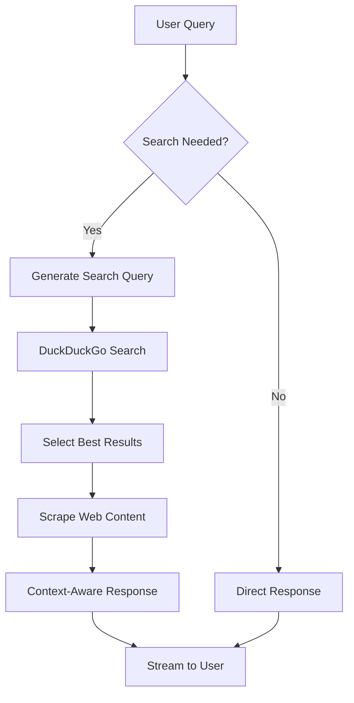

# SearchPilot - LLM Powered AI Agent for Autonomous Web Search and Context-Aware Reasoning

🔍 **SearchPilot** is an intelligent AI agent that combines the power of Large Language Models (LLMs) with autonomous web search capabilities to provide accurate, up-to-date information and context-aware responses.

## ✨ Features

- **🤖 Autonomous Web Search**: Automatically determines when web search is needed and performs intelligent searches
- **🧠 Context-Aware Reasoning**: Uses retrieved web content to provide informed, accurate responses
- **💬 Interactive Web UI**: Modern, responsive chat interface with real-time streaming responses
- **🎯 Smart Search Query Generation**: Generates optimal search queries based on user prompts
- **📊 Intelligent Result Selection**: Automatically selects the most relevant search results
- **🔄 Real-time Processing**: Streams responses as they're generated for better user experience
- **📱 Mobile-Friendly**: Responsive design that works on all devices

## 🚀 Demo


## 🛠️ Technology Stack

- **Backend**: Python, FastAPI, Ollama
- **Frontend**: HTML5, CSS3, JavaScript (Vanilla)
- **AI Model**: Llama 3.1 8B via Ollama
- **Web Scraping**: Trafilatura, BeautifulSoup4
- **Search Engine**: DuckDuckGo
- **UI Framework**: Custom responsive design

## 📋 Prerequisites

- Python 3.9 or higher
- [Ollama](https://ollama.ai/) installed and running
- Llama 3.1 8B model downloaded in Ollama

### Installing Ollama and Model

```bash
# Install Ollama (macOS)
brew install ollama

# Start Ollama service
ollama serve

# Download Llama 3.1 8B model
ollama pull llama3.1:8b
```

## 🔧 Installation

1. **Clone the repository**
   ```bash
   git clone https://github.com/RACERNOX/SearchPilot-LLM-Powered-AI-Agent-for-Autonomous-Web-Search-and-Context-Aware-Reasoning.git
   cd SearchPilot-LLM-Powered-AI-Agent-for-Autonomous-Web-Search-and-Context-Aware-Reasoning
   ```

2. **Install Python dependencies**
   ```bash
   python3 -m pip install -r requirements.txt
   ```

3. **Ensure Ollama is running**
   ```bash
   ollama serve
   ```

## 🚀 Usage

### Web Interface (Recommended)

1. **Start the web application**
   ```bash
   python3 app.py
   ```

2. **Open your browser** and navigate to `http://localhost:8000`

3. **Start chatting!** Ask questions and watch SearchPilot autonomously search the web when needed.

### Command Line Interface

1. **Run the CLI version**
   ```bash
   python3 search_agent.py
   ```

2. **Type your questions** and press Enter

## 📖 How It Works



1. **Query Analysis**: The system analyzes user input to determine if web search is required
2. **Search Query Generation**: Creates optimized search queries using LLM
3. **Web Search**: Performs searches using DuckDuckGo API
4. **Result Selection**: Uses AI to select the most relevant search results
5. **Content Extraction**: Scrapes and extracts clean text from selected web pages
6. **Context Integration**: Combines search results with user query for informed responses
7. **Response Generation**: Streams AI-generated responses with real-time updates

## 🎮 Example Use Cases

- **📈 Market Research**: "What are the latest trends in AI development?"
- **📰 News Updates**: "What happened in the tech world today?"
- **🔍 Fact Checking**: "Is the information about X accurate?"
- **📊 Data Analysis**: "What are the current stock market trends?"
- **🌍 Current Events**: "What's the latest news about climate change?"

## 🗂️ Project Structure

```
SearchPilot/
├── app.py              # FastAPI web application
├── search_agent.py     # CLI version of the agent
├── sys_msgs.py         # System prompts and messages
├── requirements.txt    # Python dependencies
├── templates/
│   └── index.html     # Web UI template
├── README.md          # Project documentation
└── .gitignore         # Git ignore rules
```

## ⚙️ Configuration

### Model Configuration
- Default model: `llama3.1:8b`
- To use a different model, update the model name in `search_agent.py` and `app.py`

### Search Configuration
- Search engine: DuckDuckGo (no API key required)
- Max results per search: 10
- Content extraction: Trafilatura with full formatting

## 🤝 Contributing

We welcome contributions! Please follow these steps:

1. Fork the repository
2. Create a feature branch (`git checkout -b feature/amazing-feature`)
3. Commit your changes (`git commit -m 'Add amazing feature'`)
4. Push to the branch (`git push origin feature/amazing-feature`)
5. Open a Pull Request

## 📝 License

This project is licensed under the MIT License - see the [LICENSE](LICENSE) file for details.

## 🙏 Acknowledgments

- [Ollama](https://ollama.ai/) for providing easy LLM deployment
- [FastAPI](https://fastapi.tiangolo.com/) for the excellent web framework
- [Trafilatura](https://trafilatura.readthedocs.io/) for web content extraction
- [DuckDuckGo](https://duckduckgo.com/) for search capabilities

## 📞 Support

If you encounter any issues or have questions:

1. Check the [Issues](https://github.com/RACERNOX/SearchPilot-LLM-Powered-AI-Agent-for-Autonomous-Web-Search-and-Context-Aware-Reasoning/issues) section
2. Create a new issue with detailed information
3. Join our discussions in the [Discussions](https://github.com/RACERNOX/SearchPilot-LLM-Powered-AI-Agent-for-Autonomous-Web-Search-and-Context-Aware-Reasoning/discussions) tab

## 🔮 Roadmap

- [ ] Add support for more LLM models
- [ ] Implement conversation memory persistence
- [ ] Add voice input/output capabilities
- [ ] Create browser extension
- [ ] Add support for image analysis
- [ ] Implement multi-language support

---

⭐ **Star this repository if you find it useful!**

Made with ❤️ by [RACERNOX](https://github.com/RACERNOX)
